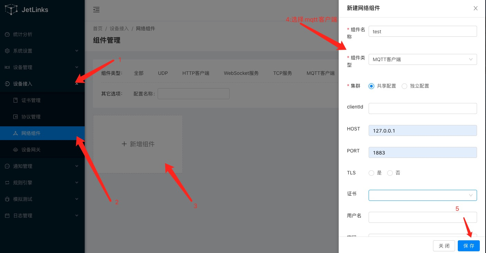
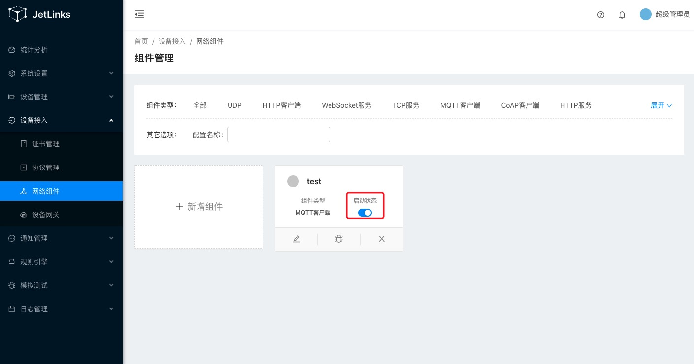
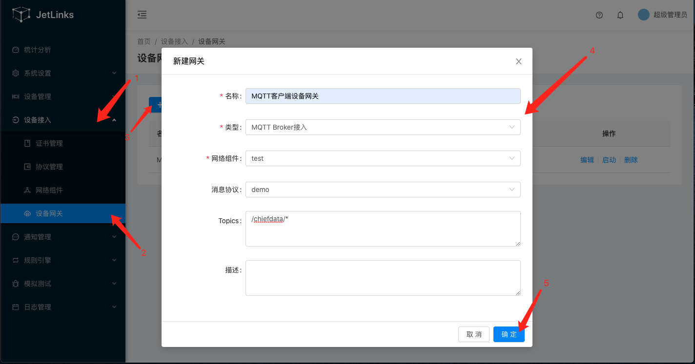
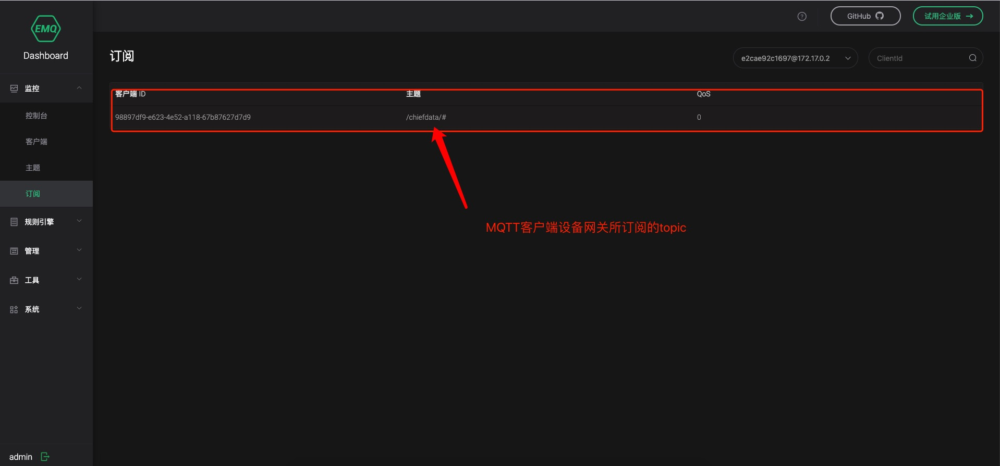

# 启动MQTT客户端设备网关,接收设备消息

创建MQTT客户端设备网关,用于设备已连接到第三方MQTT服务上时，处理设备消息。

## 一. 创建MQTT客户端

进入系统: `网络组件`-`组件管理` 点击左侧菜单中的`MQTT客户端` 添加一个MQTT客户端。

### 测试连接

使用[EMQ](https://docs.emqx.io/broker/v3/cn/install.html)软件进行连接测试.

1.[安装](https://docs.emqx.io/broker/v3/cn/install.html#)完成EMQ，并启动

2.进入emq客户端监控界面

3.点击状态列中的`已停止`开启服务. 状态变为`已启动`则为启动完成.

4.在EMQ客户端监控列表中，看到客户端连接成功。表示mqtt客户端正常。

## 创建设备网关

新建设备网关配置

### 设备网关连接测试

#### 前提条件

i. 已在平台中创建产品和设备

> 创建产品和设备具体操作细节，请参考[添加设备型号](../device-manager.md/#添加设备型号)、[添加设备实例](../device-manager.md/#添加设备实例)。
>
> 设备接入平台，请参考[设备接入教程](device-connection.md)

#### 创建成功的设备实例信息展示
     
i. 设备基本信息

ii. 设备运行状态信息

iii. 设备日志

使用[MQTT.fx](http://mqttfx.org/)软件进行连接测试

1.启动网关:

i. 点击`操作`列中的`启动`按钮,启动网关。

ii. 在EMQ订阅监控列表中，看到有MQTT客户端设备网关新建时，设置的topics订阅记录，表示网关topic订阅成功。

2.使用MQTT.fx连接上EMQ

> 注意：上图第2步中port为EMQ服务所暴露的端口

3.发送设备上线消息到EMQ中

4.设备上线表示设备设备网关连接成功

网关状态说明:

1. 停止:网关完全停止.不再接受设备连接,以及消息.重新启动后只会接受最新的连接以及消息。
2. 暂停:网关不再接受新的设备连接,以及消息.重新启动后恢复处理之前的所有连接的消息。
3. 启动:网关处理新的设备连接以及消息。

## 设备连接

参照[使用自定义消息协议接入设备](device-connection.md)进行设备配置,注册,以及连接,消息收发测试。