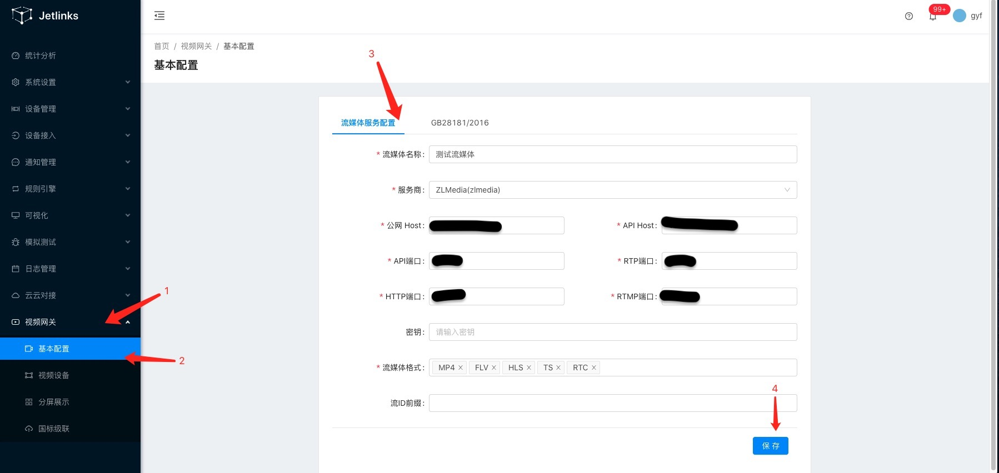
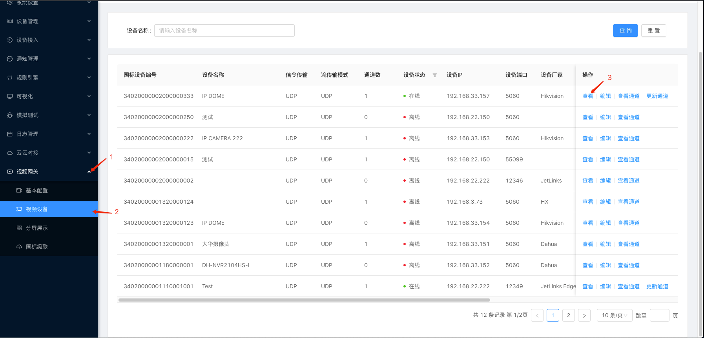
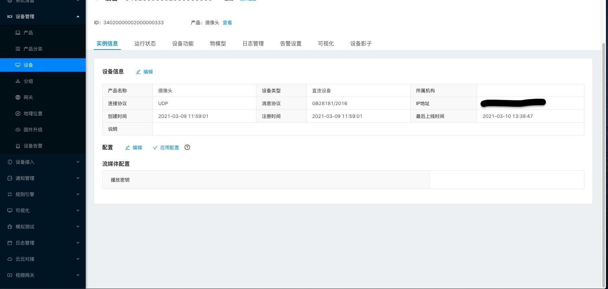
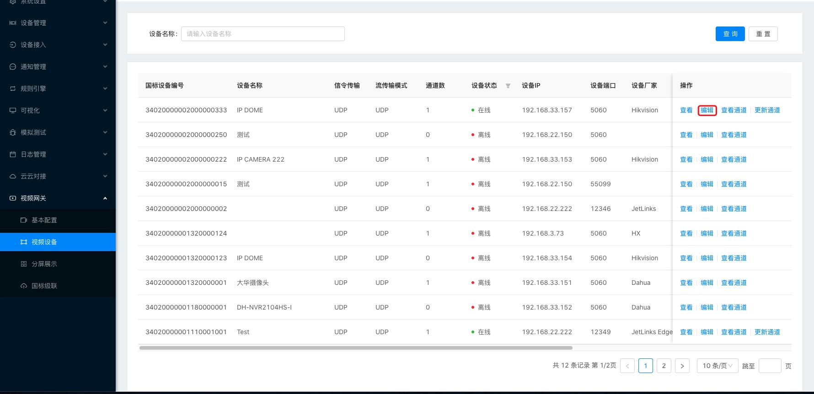
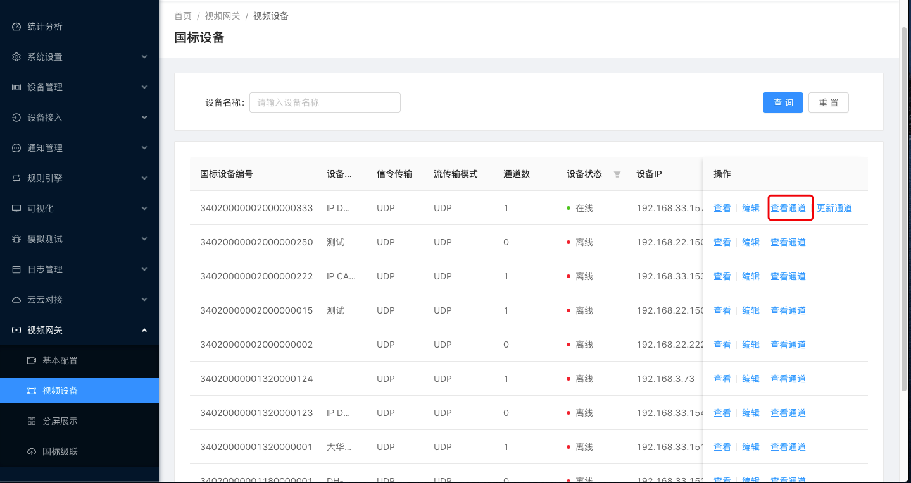
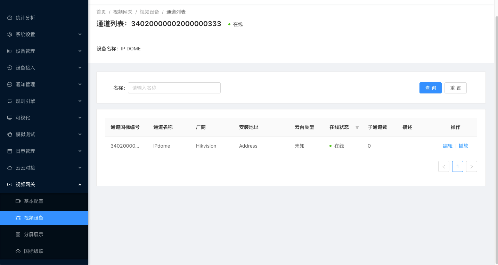
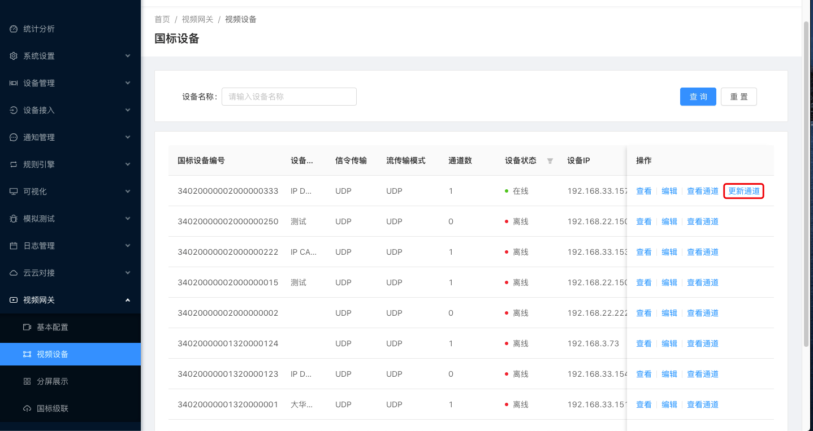
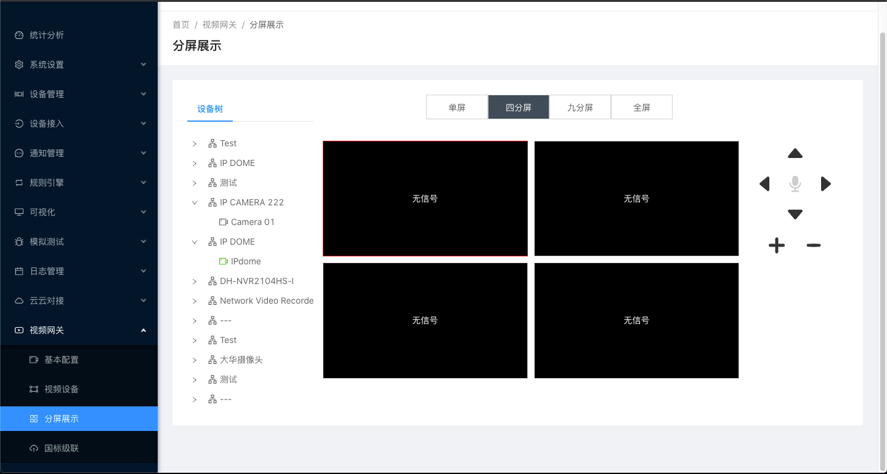
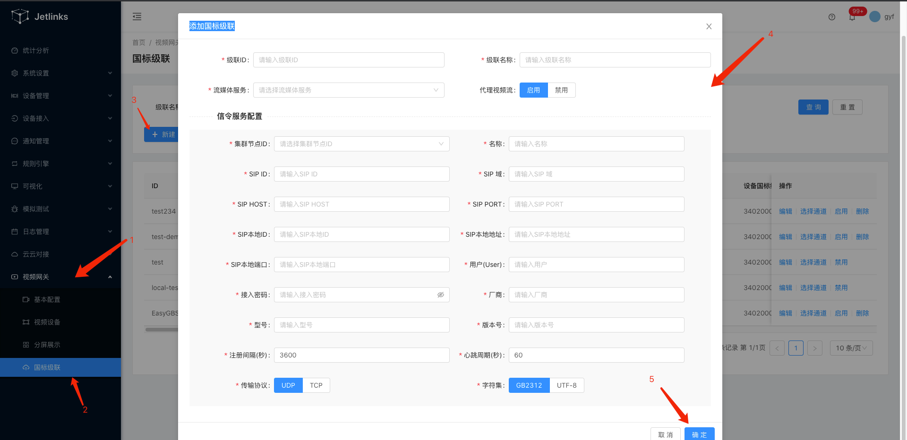

# 视频网关

## 基本配置

### 操作步骤

1、进入系统：`视频网关`-`基本配置`

2、填写流媒体基本到信息。

具体配置信息。查看[配置示例](../media-guide/media-base-config.md)

3、点击保存。

:::tip 注意 GB28181/2016标签也需要配置
:::

## 视频设备

可以对连接到设备查看，编辑，查看通道和更新通道

### 查看

#### 操作步骤：

1、进入系统：`视频网关`-`视频设备`-`查看`

2、跳转到设备到基本信息界面

### 编辑

选择需要编辑到设备，在操作栏点击编辑，可以对设备对基本信息进行编辑

### 查看通道

点击操作栏`查看通道`可以查询到此设备所使用的通道和基本的信息以及查看摄像头监控画面。

### 更新通道

## 分屏展示

分屏展示对摄像头监控画面进行播放，支持单屏，四分屏，九分屏，和全屏，对于可以旋转对摄像头也可以通过右边对调节按钮调整摄像头方向。

## 国标级联

把本地平台的设备推送给上级平台。

### 新增

#### 操作步骤：

1、进入系统：`视屏网关`-`国标级联`-`新建`

2、填写上级平台的基本信息。

3、点击确定保存

### 编辑

在操作栏点击`编辑`用于修改连接上级平台的基本信息

### 选择通道

在操作栏点击`选择通道`可以选择不同的通道来进行上传。

